# About Me

## Flexible Robots

{style="max-height:6in;max-width:100%;"}
{style="max-height:6in;max-width:100%;"}

## Physics-Based Simulation

.mp4){style="max-height:6in;max-width:100%;"}

##

{style="max-height:6in;max-width:100%;"}

##

{style="max-height:6in;max-width:100%;"}

##

.mp4){style="max-height:6in;max-width:100%;"}

## More Recent

{style="max-height:6in;max-width:100%;"}

## Flexible Robot

{style="height:2.5in;margin:0px;spacing:0px;"}
{style="height:2.5in;margin:0px;spacing:0px;"}  

## Simulation

{style="max-height:6in;max-width:100%;"}  

## Video

{style="max-height:6in;max-width:100%;"}
<!-- 
## Final Video

{style="max-height:6in;max-width:100%;"} -->

## Other Stuff

.mp4){style="max-height:6in;max-width:100%;"}

# Bio-Inspired Robots

## Feathered Drone

{style="max-height:6in;max-width:100%;"}

## Digging in Granular Media

{style="max-height:6in;max-width:100%;"}

## SoFi

{style="max-height:6in;max-width:100%;"}

## Salamander-Inspired Robot

{style="max-height:6in;max-width:100%;"}

## Squirrel Inspired Robot

{style="max-height:6in;max-width:100%;"}

## Undulating Robot

{style="max-height:6in;max-width:100%;"}

## Salto-Squirrel

{style="max-height:6in;max-width:100%;"}

## Climbing Robot

{style="max-height:6in;max-width:100%;"}

## Raptor-Inspired Drone w/ Morphing Wing

{style="max-height:6in;max-width:100%;"}

## Sloth-Inspired Mechanisms

{style="max-height:6in;max-width:100%;"}

<!-- ##

{style="max-height:6in;max-width:100%;"} 
-->

# Deployable Structures

## Domes

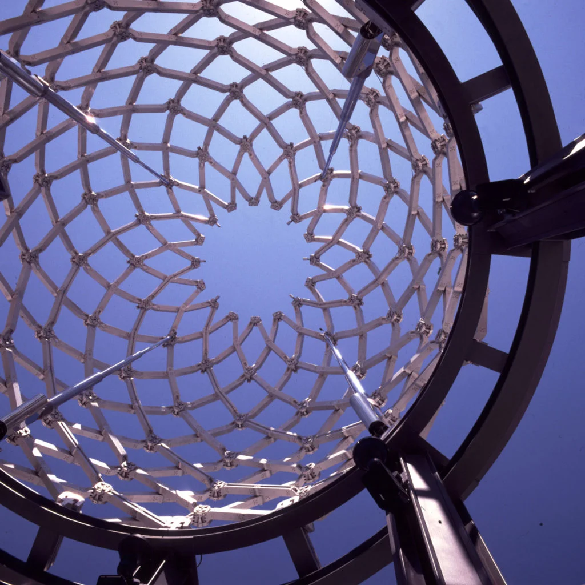{style="height:2.5in;margin:0px;spacing:0px;"}
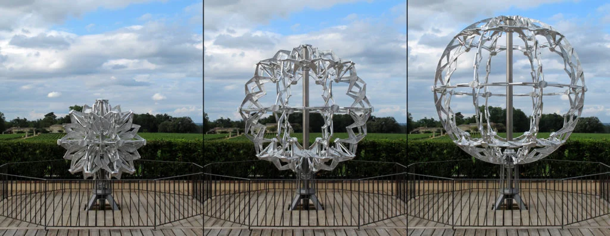{style="height:2.5in;margin:0px;spacing:0px;"}

## Origami-Inspired Deployable Structures

<https://www.pinterest.com/pin/405253666445990755/>

## Hoberman

{style="max-height:6in;max-width:100%;"}

## Moving Sculptures

{style="max-height:6in;max-width:100%;"}

# Tensegrity Devices

## Tensegrity Devices

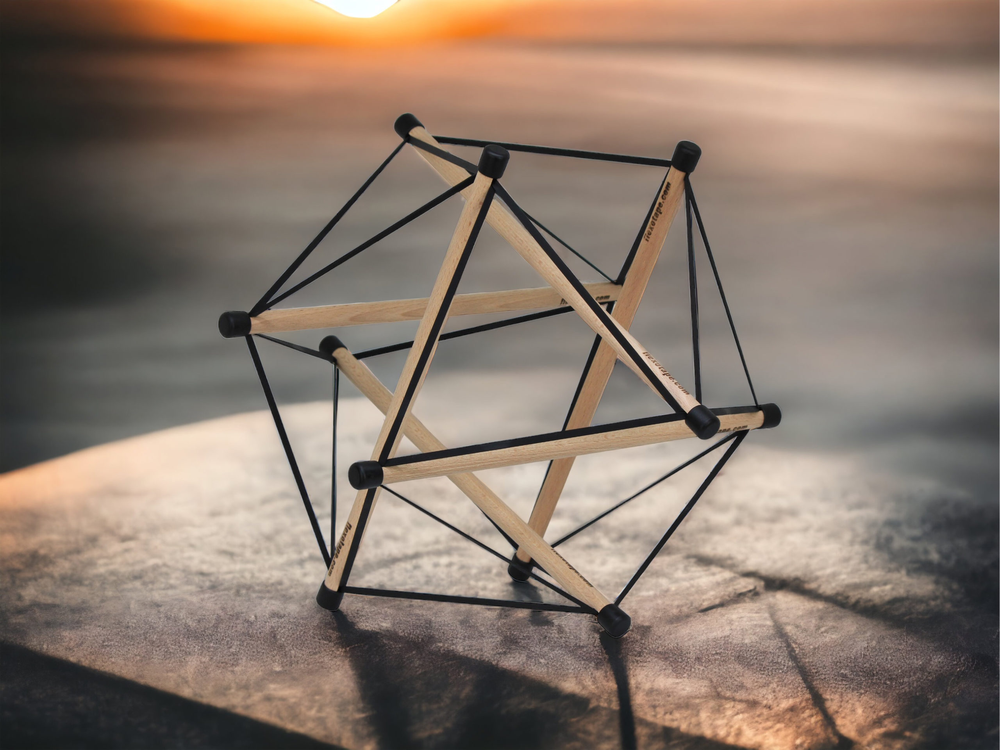{style="height:2.5in;margin:0px;spacing:0px;"}
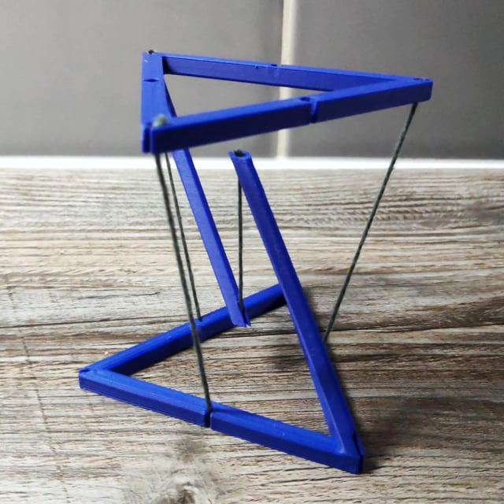{style="height:2.5in;margin:0px;spacing:0px;"}

## Tensegrity Robots

{style="max-height:6in;max-width:100%;"}

# Curved Crease Concepts

## Kiriform

 [Ybf49Hrk0wg].mp4){style="max-height:6in;max-width:100%;"}

## Product Packaging

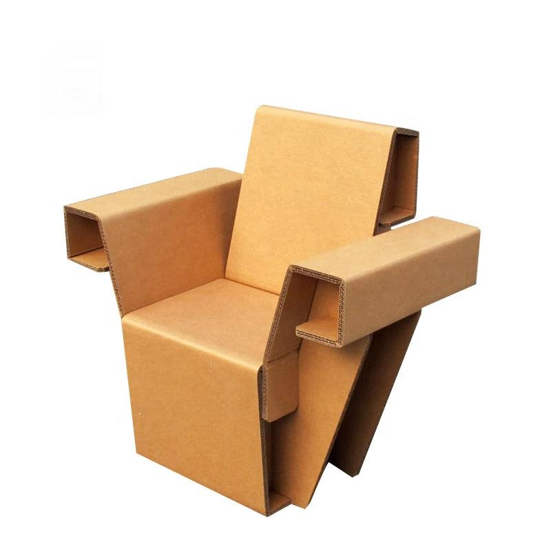{style="height:2.5in;margin:0px;spacing:0px;"}
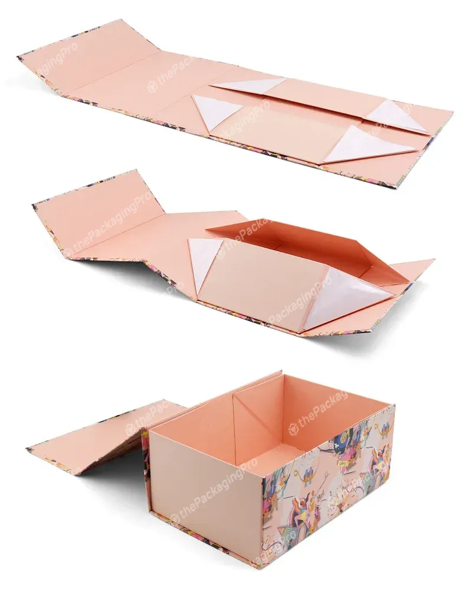{style="height:2.5in;margin:0px;spacing:0px;"}
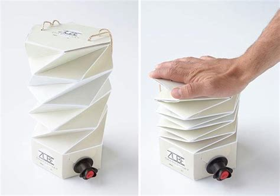{style="height:2.5in;margin:0px;spacing:0px;"}
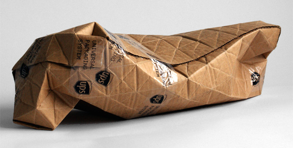{style="height:2.5in;margin:0px;spacing:0px;"}
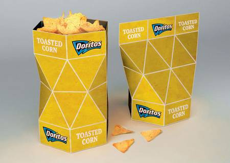{style="height:2.5in;margin:0px;spacing:0px;"}

## Creative Folding for Leaflets

<https://animalia-life.club/qa/pictures/creative-leaflet-folding>

## Origami-Inspiration

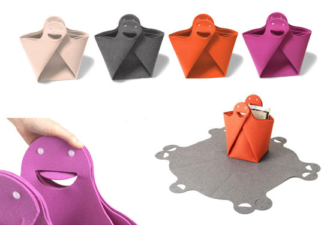{style="height:2.5in;margin:0px;spacing:0px;"}
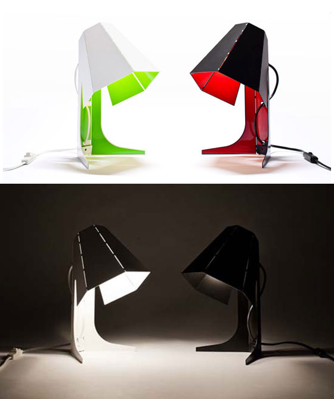{style="height:2.5in;margin:0px;spacing:0px;"}  
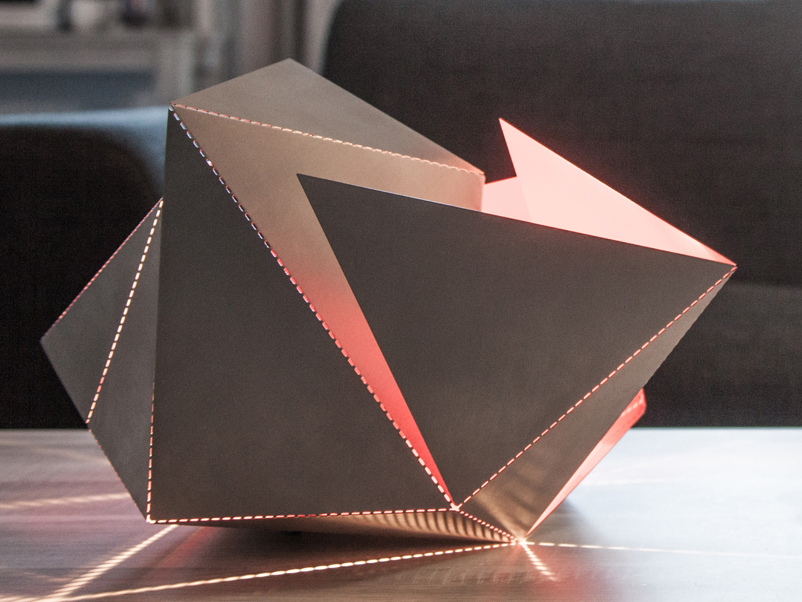{style="height:2.5in;margin:0px;spacing:0px;"}
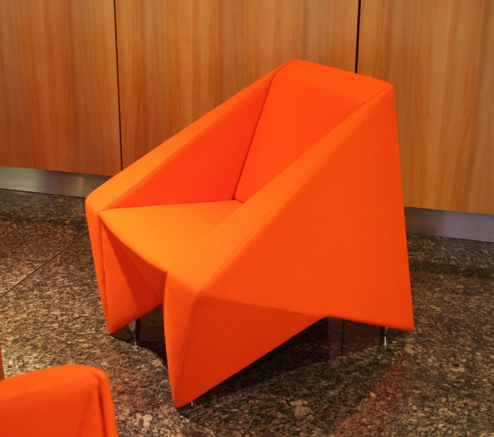{style="height:2.5in;margin:0px;spacing:0px;"}

::: {style="font-size:12pt;"}
<https://www.fastcompany.com/3052128/the-folding-lamp-makes-origami-out-of-light>
:::

## Origami Twist Light

{style="max-height:6in;max-width:100%;"}

## Self Folding Origami

{style="max-height:6in;max-width:100%;"}

# Popup Books

## Popup Examples 1

{style="max-height:6in;max-width:100%;"}

## Popup Examples 2

{style="max-height:6in;max-width:100%;"}

## Gymnastics Popup Book

{style="max-height:6in;max-width:100%;"}

## Serial Spherical Mechanisms

{style="max-height:6in;max-width:100%;"}

## Top Ten popup book shapes

{style="max-height:6in;max-width:100%;"}

# Mechanisms

::: {style="font-size:12pt;"}

* <https://www.youtube.com/user/thang010146/videos>
* <https://hackaday.com/2016/02/29/2100-mechanical-mechanisms/>
* <https://www.designswan.com/archives/every-origami-15-origami-inspired-product-designs.html>
:::
