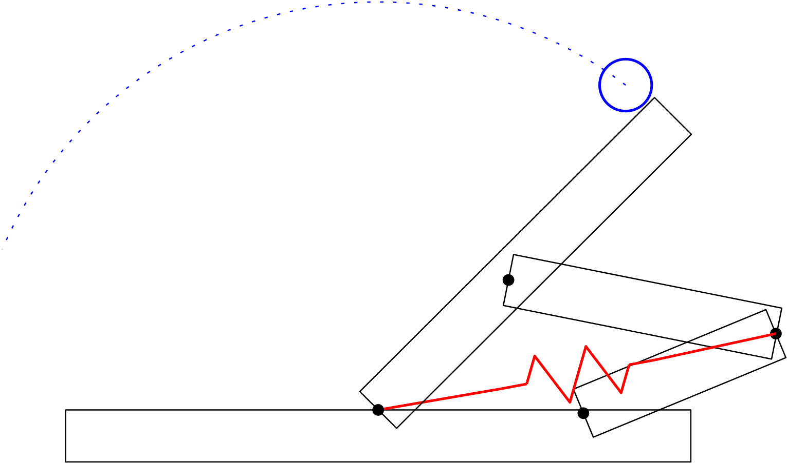
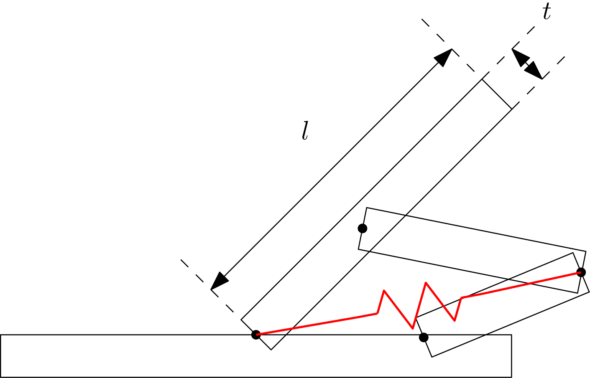

# Science Vs. Engineering

## What is the Difference between Science  and Engineering

> The questions we ask.

## Scientists Ask More "Why/How" Questions

::: incremental

* "How did the universe begin"
* "Why is an animal a certain shape or size."
* "How do people get sick?"
* ...
:::

## Sciency Questions

> Why does $Y$ happen

> How does $X$ make $Y$ happen?

## Paleobionics

{style="max-height:6in;max-width:100%;"}

## Paleo Biomechanics

{style="max-height:6in;max-width:100%;"}

## Engineers _Use_ Science to Make Things Better

::: incremental

* How can I use my knowledge of Chemistry to make better medicines
* How can I use my knowledge of Physics to build safer bridges and schools?
* How can I use my knowledge of Electricity and Chemistry to make better Batteries
* ...
:::

## Engineery Questions

> "How can I make $X$ do more $Y$?"

## Salto

{style="max-height:6in;max-width:100%;"}

# Experiments

## Experiments

* Engineers and Scientists both use experiments
* They use them differently because they have different questions.

## Experimental Design Process

{style="background:#ffffff;max-height:5in;max-width:100;"}

## Change your Question into a Guess

> Also Called a Hypothesis

## How to make a hypothesis

::: incremental

* Use knowledge AND common sense
* What are you trying to do?
* What variables have the most impact on $Y$?
:::

. . .

> "I think making $A$ (bigger or smaller ) will make $X$ do more $Y$."

## Parts of an experiment

::: incremental

* Control your Environment
* Control your Experiment
* Measure your Experiment
* Change and Repeat your Experiment
:::

## Control your Environment

::: incremental

* Temperature
* Wind
* Light
* ...
:::

## Control your Experiment

::: incremental

* Push something with a motor
* Heat something with a heating element
* Pump a liquid
* ...
:::

## Measure with Sensors

::: incremental

* Force Gauge or Scale
* Measuring Tape
* Camera
* Thermometer
* Pressure
* Humidity
* ...
:::

## Change and Repeat

::: {style="font-size:18pt;"}
> $A$ in "I think making $A$ (bigger or smaller ) will make $X$ do more $Y$."

::: incremental

* A roboticist / engineer changes their
    * mechanical design
    * control scheme
    * learning strategy
* A doctor / biologist changes their
    * medicine
    * surgical technique
* A computer scientist changes their:
    * algorithm
:::
:::

## Mechanical Design

Change:

::: incremental

* Geometry or Shape
* Mass or Weight
* Spring -- size, shape
:::

# Challenge

##

{style="background:#ffffff;max-height:5in;max-width:100;"}

## Experimental Design Process

::: incremental

* What are you trying to do
* What environmental conditions should you control
* What should you change?
* What should you not change
* What should you measure?
:::

## Design Change

{style="background:#ffffff;max-height:5in;max-width:100;"}

## Other Inspiration

## Jumping Bird

{style="max-height:6in;max-width:100%;"}

## Jumping Bird

{style="max-height:6in;max-width:100%;"}

## Jumping Bird

{style="max-height:6in;max-width:100%;"}

## Jumping Bird

{style="max-height:6in;max-width:100%;"}

## Jumping Bird

{style="max-height:6in;max-width:100%;"}

## Jumping Bird

{style="max-height:6in;max-width:100%;"}

## Insect-inspired Microrobots

{style="max-height:6in;max-width:100%;"}

# BioMechanics

# Other Engineering

## Morphing Drone

{style="max-height:6in;max-width:100%;"}

## Paddling Mechanism

{style="max-height:6in;max-width:100%;"}
